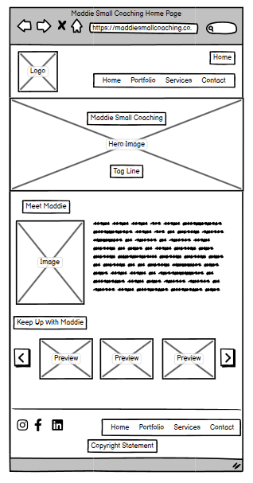
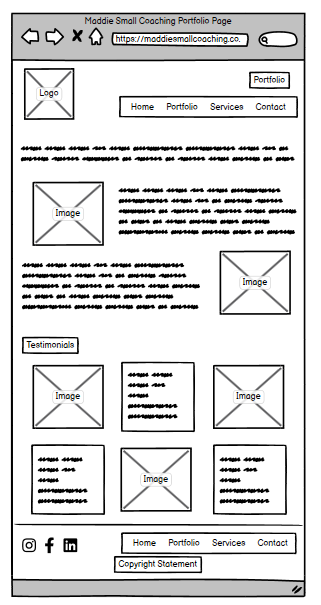
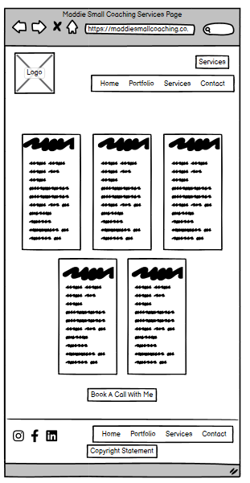
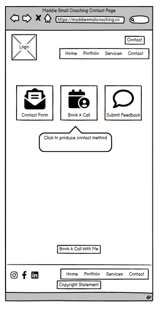

# Maddie Small Coaching
This website is a showcase for Maddie Small Coaching providing information on her services, a space to market her business, and an opportunity for clients to make bookings and contact her.

# User Experience - Strategy

### Owner Goals
- Provide potential clients with information about the business.
- Provide potential and current clients with a contact method.
- Provide potential and current clients with a way to book a call or session.
- Provide a platform to display marketing material such as news updates and testimonials.
- A professional and captivating design to support brand messaging.

### User Goals

As a user I want:

- Intuitive navigation.
- Easy to read information.
- To be able to view the website across various screen sizes.
- Easy to use features.

#### Clients

As a client I want:

- To be able to find the information I need easily.
- To be able to book a call or session easily.
- To be able to contact the business easily.
- To be able see what services are provided.
- To be able to see what is new with the business.
- To be able to see previous work examples.
- To be able to review current testimonials.
- To be able to submit feedback.

# User Experience - Scope

#### Features based on the goals:

- Responsive design.
- Navigation bar
    - Located consistently in the header for all pages and containing links to:
    - Services page
    - About Page (home page)
    - Portfolio and Testimonials page
    - Contact page
- About Page (home):
    - Hero image & summary section.
    - Biography section.
    - News Carousel. 
- Portfolio page:
    - Portfolio section.
    - Testimonial gallery.
- Services page:
    - Services cards.
    - Call to action redirecting viewers to contact page.
- Contact page:
    - Contact form
    - Feedback form
    - Booking system for calls and sessions
- Footer containing:
    - Social media links.
    - Quick links for navigation.

# User Experience - Structure

Opening the website will start the user on the about page.
- This contains a summary of Maddie Small Coaching, a bio about Maddie, and a news carousel.
    - This will give the user an idea of what Maddie Small Coaching provides and who Maddie is which will enable them to decide if they want to know more about the business and browse further pages in the navigation bar.

The navigation bar present in the header with quick links in the footer across all pages will provide the user with options for further information:

The portfolio page:
- This contains information about work Maddie has done previously and testimonials from her clients.

The services page:
- This contains information about the services Maddie provides and a quick link for users to make a booking.

The contact page:
- This contains forms for contacting Maddie, providing feedback, or making a booking with her.

# User Experience - Skeleton 

Wireframes generated in Balsamiq 

### About Page (Home) Wireframe

### Portfolio Page Wireframe

### Services Page Wireframe

### Contact Page Wireframe

